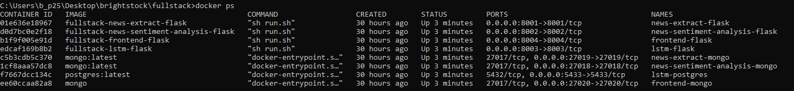

# Group 5 - Big Data Project Spring '23

## Contents
- [System Requirements](#system-requirements)
    - [Minimum](#minimum)
    - [Recommeded](#recommeded)
- [Prerequisites](#prerequisites)
- [Installation](#installation)
    - [Running a Docker](#running-a-docker)
    - [Testing the Docker](#testing-the-docker)
    - [Seed Database](#installation)

## System Requirements
### Minimum
 - 40GB Hard Drive space
 - 8GB Ram  

### Recommeded
 - 80GB Hard Drive space
 - 16GB Ram  

## Prerequisites
 - [Docker](https://docs.docker.com/engine/install/)

## Installation
### Running a Docker
- Start a docker in a background using `-d`
- **Caution**: the follow command needs `10 minutes` to run.
```
$docker compose up -d
```
You will see a bunch of installing messages. Wait until you see the following statement. 
```
[+] Running 8/8
 - Container lstm-postgres                  Started  1.2s
 - Container frontend-mongo                 Started  0.6s
 - Container news-sentiment-analysis-mongo  Started  1.2s
 - Container news-extract-mongo             Started  1.2s
 - Container lstm-flask                     Started  1.7s
 - Container news-sentiment-analysis-flask  Started  2.1s
 - Container frontend-flask                 Started  1.5s
 - Container news-extract-flask             Started  2.7s
```
You can use the following command to check if all eight contianers are running.
```
docker ps
```


### Testing the Docker